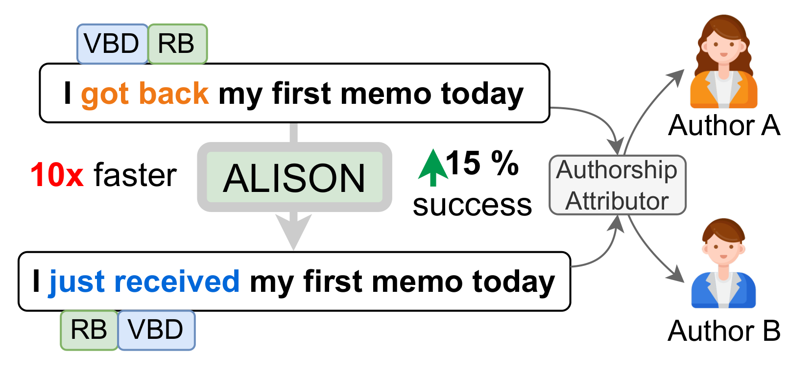

# ALISON: Fast and Effective Stylometric Authorship Obfuscation

<p align="center">

</p>

## Data
The three datasets used can be found in the Data folder. Due to TuringBench's large size, it has been partitioned into three files.

## Usage
First, clone this repo:
```
git clone https://github.com/EricX003/ALISON
```
And resolve dependencies:
```
pip install -r requirements.txt
```

### Train the Attributor:

```
python Train.py
```
Arguments:

  * --train: The path to the training data.
  * --authors_total: Total number of authors in the dataset (default 10)
  * --dir: Path to the directory containing the trained model (Contains feature set, model, etc.)
  * --trial_name: Name of the trial (human-readable) to generate the save directory (default is an empty string)
  * --test_size: Proportion of Data to use for network testing (default 0.15)
  * --top_ngrams: t, The Number of top character and POS-n-grams to retain
  * --V: V, the set of n-gram lengths to use (default '[1, 2, 3, 4]')

Additional arguments for fine-tuning the hyperparms of the training of the n-gram-based neural network model are provided and can be accessed via:
 ```
python Train.py -h
```

### For Obfuscation:

```
python Obfuscate.py
```

Arguments:

  * --texts: The path to the texts for obfuscation.
  * --authors_total: Total number of authors in the dataset (default 10)
  * --dir: Path to the directory containing the trained model (Contains feature set, model, etc.)
  * --trial_name: Name of the trial (human-readable) to generate the save directory (default is empty string)
  * --L: L, the number of top POS n-grams to consider for obfuscation (default 15)
  * --c: c, the length scaling constant (default 1.35)
  * --min_length: The minimum length of POS n-gram to consider for obfuscation (default 1)
  * --ig_steps: Number of steps associated with discrete integral calculation for Integrated Gradients attribution (default 1024)

## Citation
```bibtex
@inproceedings{xing2024alison,
      title={ALISON: Fast and Effective Stylometric Authorship Obfuscation}, 
      author={Eric Xing and Saranya Venkatraman and Thai Le and Dongwon Lee},
      booktitle={AAAI},
      year={2024},
}
```
